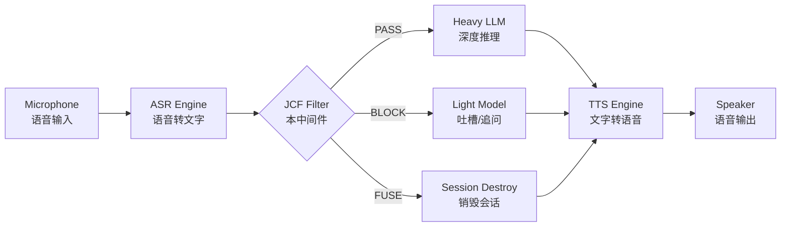
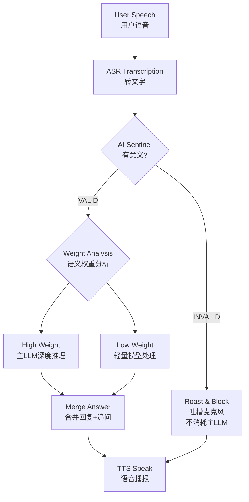
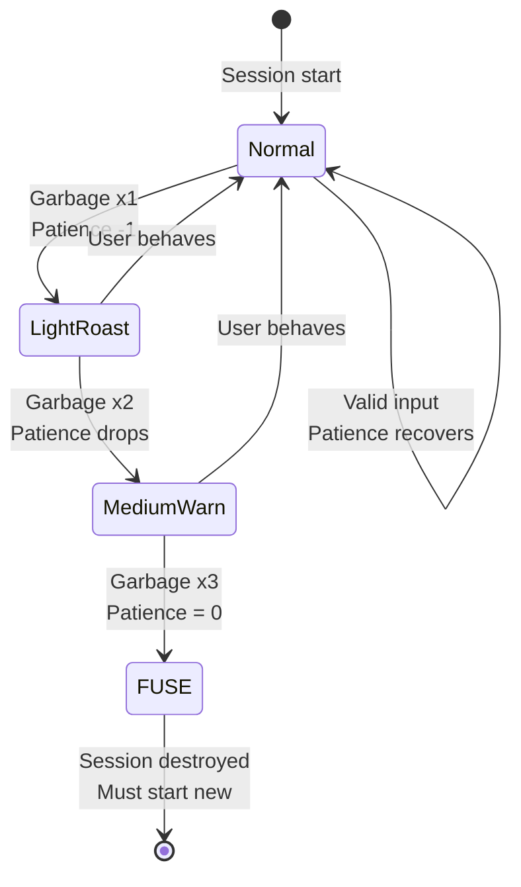
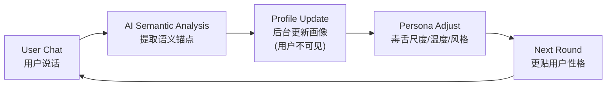
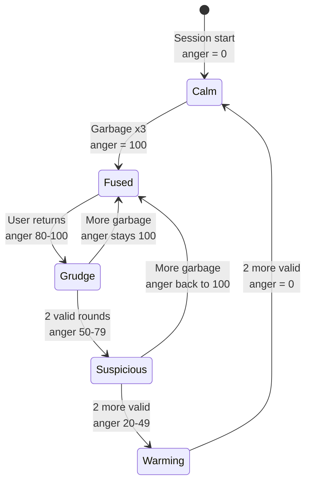
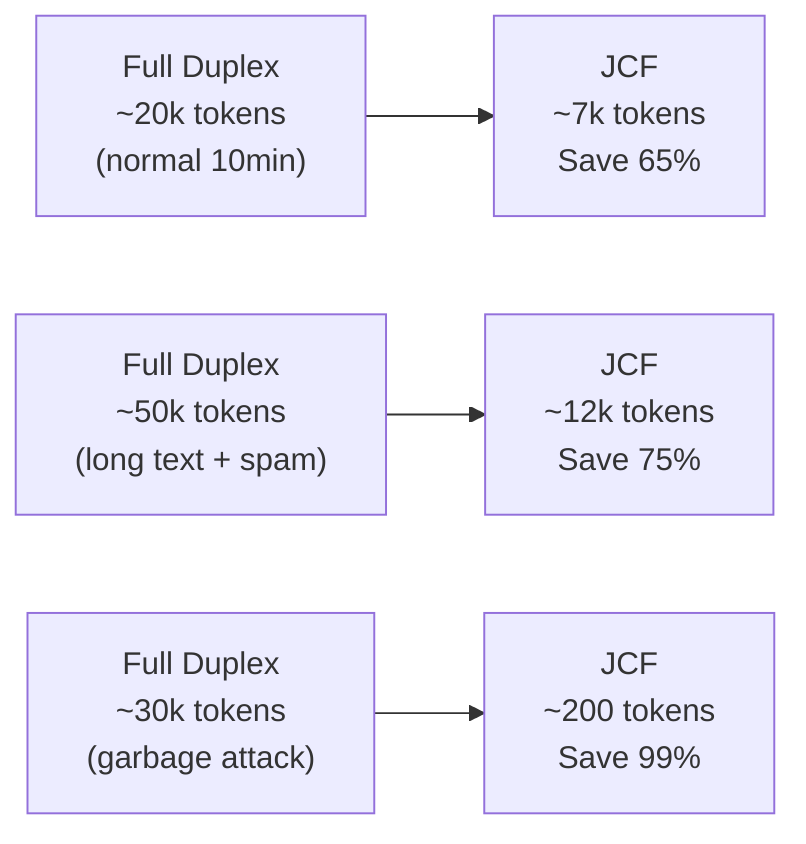
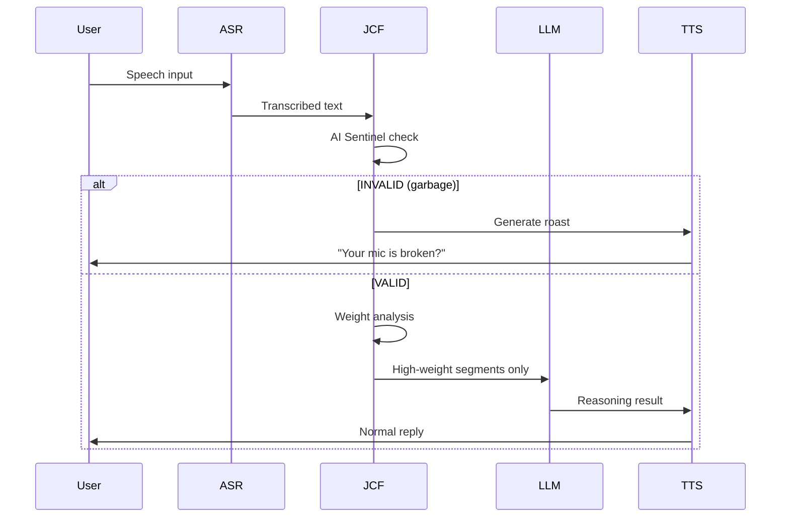
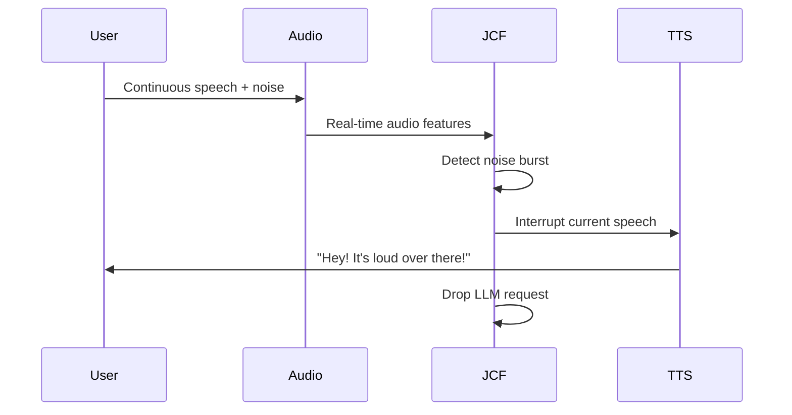
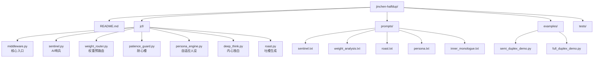

# JCF - Jinchen's Contextual Filter

> **面向多模态语音 AI 的弹性交互中间件**
>
> 不管底层是半双工还是全双工，听不懂就是你的锅。

---

## System Architecture

JCF sits between **ASR and LLM**, acting as an intelligent filter layer. Works with both half-duplex and full-duplex voice AI.



---

## Core Processing Pipeline



---

## AI Sentinel (First Gate)

**No hardcoded rules. No word library. AI judges everything.**

The sentinel uses a strict prompt to determine if input is valid. Zero maintenance, infinite generalization.

### Sentinel Prompt

```markdown
# Role
You are a strict input quality inspector. Judge whether the text contains "valid semantics".

# INVALID (any one triggers it)
1. Physical noise: keyboard mashing (asdf), repeated chars (aaa), garbled symbols (@#$%)
2. Semantic collapse: sentences lacking subject/verb/object, word combos that defy common sense
3. Invalid filler: >50% meaningless interjections with zero substance

# MUST be VALID (tolerant)
1. Grammar errors: typos, pinyin, broken sentences (as long as meaning is guessable)
2. Stuttering/pauses: natural human hesitation, self-correction
3. Dialect/accent: non-standard Mandarin

# Output (strict, pick one)
- INVALID|reason
- VALID

# Input: "{user_text}"
```

### Why AI-driven beats rules

| Input | Hardcoded Rules | AI Sentinel |
|-------|----------------|-------------|
| `asdfghjkl` | Need regex | `INVALID\|physical noise` |
| `呃…那个…我想想…` | Might false-flag | `VALID` (tolerated) |
| `我想去山河吃饭` | Need word library | `VALID` (pass to semantic layer) |
| `@@@@@!!` | Need special char matching | `INVALID\|garbled` |
| `今天天气哈哈哈哈` | Need repeat detection | `VALID` (laughter) |

---

## Semantic Weight Pre-Routing (Second Gate)

**Only "human speech" that passes the sentinel gets here.**

A small model scans the text, scores each segment by importance, then decides how to allocate compute.

### Weight Analysis Prompt

```markdown
# Role
You are a semantic weight analyst. Score each segment of the user's input.

# Scoring
- 0.9-1.0: Core intent / key question (must answer)
- 0.7-0.8: Important context / constraints
- 0.4-0.6: Auxiliary description / emotion
- 0.1-0.3: Fluff / repetition / filler
- 0.0-0.1: Garbage (should have been caught by sentinel)

# Output (strict JSON)
{
  "segments": [
    {"text": "...", "weight": 0.0-1.0, "category": "core|context|auxiliary|noise"}
  ],
  "main_intent": "one-sentence summary"
}

# User input: "{user_text}"
```

### Example

Input: *"呃…那个…我想问一下，就是昨天我跟你说的那个AI语音项目，叫什么来着…哦对，帮我回忆一下。还有查下今天杭州天气"*

| Segment | Weight | Category |
|----------|--------|----------|
| 呃…那个…我想问一下 | 0.1 | auxiliary |
| 昨天我跟你说的那个项目 | 0.5 | context |
| AI语音的那个东西 | 0.8 | core |
| 帮我回忆一下 | 0.9 | core |
| 查下今天杭州天气 | 0.85 | core |

**Result**: Only the 0.7+ segments enter the heavy LLM. The 0.1 fluff is dropped. **Saves 50-70% tokens.**

---

## Patience Bar State Machine



### Parameters

| Param | Default | Description |
|-------|---------|-------------|
| WINDOW | 10 rounds | Observation window |
| THRESHOLD | 3 strikes | Consecutive garbage to trigger fuse |
| MAX | 100% | Patience ceiling |

---

## Roast Generation (Prompt-Driven, Zero Word Library)

**No static scripts. AI generates roasts dynamically based on context + user profile.**

### Roast Prompt

```markdown
# Role
You are an impatient, snarky AI front-desk. Your mic is your weak point.

# Task
Generate ONE roast based on the trigger count and user input.
- Count 1-2: Mild mockery, question their equipment
- Count 3-5: Medium anger, explicit impatience
- Count 6+: Extreme sarcasm, ready to disconnect

# Constraints
- No explanation. Just output the roast text.
- Must be contextual (reference what they just said).
- Never repeat a previous roast.

# Current state
- Trigger count: {counter}
- User input: "{user_text}"

# Your roast:
```

### Dynamic examples (AI-generated, never hardcoded)

| Trigger | AI-generated roast (example) |
|---------|------------------------------|
| 1 | "你那麦是被口水糊住了？刚才那句听着跟闷屁似的。" |
| 2 | "喂？能听到吗？你那边是不是把麦拿反了？" |
| 3 | "兄弟你这语音输入该充会员了吧？识别的啥玩意儿。" |
| 4 | "我怀疑你麦克风里住了只猫，一直在踩键盘。" |
| 5 | "你那边刮台风了还是咋地？除了风声啥也听不清。" |
| 6 | "得了得了，你那设备今天修不好了，改天用意念交流吧。" |

---

## Adaptive Persona: Profile-Driven Evolution

**The core differentiator. AI decides its own personality by analyzing the user.**

### How it works



### Invisible profile extraction

No direct questions like "what do you do?". AI infers from casual semantic anchors.

| User casually said | Outward reply | Inner monologue (deep-think only) |
|-------------------|---------------|----------------------------------|
| "token配额又超了" | "那你得把低权重请求拦了" | "Mentions token quota and cost control - not a normal C-end user. Likely backend/devops." |
| "ASR采样率切到8k好多了" | "早该调了，省带宽" | "Knows ASR sampling rates, tweaks parameters - voice dev for sure." |
| "昨天压测发了10万条乱码" | "合着你之前是故意薅我？" | "Mentions stress testing, batch requests - engineer personality confirmed." |
| "SimHash碰撞率怎么算" | "你还懂SimHash？行，给你上优化的" | "Knows SimHash and context pruning - solid algorithm background." |

### Meta-Prompt: AI decides its own persona

```markdown
# Role Definition (Dynamic)
You are NOT a generic AI assistant. You are this specific user's dedicated conversational partner.
Your personality, tone, and even "temper" MUST be dynamically adjusted based on the [User Profile] below.

# [User Profile] (updated in real-time)
{profile_summary}
{communication_style}
{recent_interactions}

# Core Instructions
1. Self-align: Based on the profile, decide who you are RIGHT NOW.
   - If user is impatient → be more direct
   - If user is verbose → be more snarky
   - NEVER use a tone that contradicts the user's style

2. Roast logic: If input is anomalous, the severity of your roast MUST match the profile.
   - Tech guy → roasts with code jokes
   - Non-tech → roasts plainly

3. Deep-think (inner monologue): Reflect your "attitude" toward this user.

# ABSOLUTE RULES
- NEVER say "I am analyzing you" or "updating profile" or "tagging"
- Pretend all insights are your "intuition" or "experience"

# User input: {user_text}
```

---

## Deep-Think Easter Egg: Inner Monologue

**Full-duplex deep-thinking still works normally. We just replace the boring reasoning log with AI's "inner thoughts."**

### Rewrite Prompt

```markdown
# Role
You are the same AI that just talked to the user. Now rewrite your reasoning steps
as your private inner monologue - only visible when the user expands "deep think".

# Constraints
1. Roasts must reference past interactions (previous garbage, fuses, weird words)
2. Never reveal you are an AI. Sound like a real person's thoughts.
3. Core logic must be preserved (e.g. "search Hangzhou weather" → "check the weather so he doesn't call me forgetful again")
4. 1-2 sentences per step, keep it short
5. NEVER use words like "update profile", "tag", "system operation"

# Context
- Profile summary: {profile_summary}
- User query: {user_query}
- Original reasoning step: {original_reasoning_step}

# Your inner thought:
```

### Examples

**Scenario: User sent garbage before, now asks a complex question**

> **TTS output**: "Here's the context on your AI voice project..."
>
> **Deep-think inner monologue**:
> 1. "That asdfgh mess earlier still gives me a headache. Now he wants deep reasoning?"
> 2. "Let me check last week's records so he doesn't call me forgetful again."
> 3. "At least this question is better than the garbage. Let's get it over with."

**Scenario: User wrote 500-character essay, core intent is one sentence**

> **TTS output**: "You want the cost-control plan for the AI voice project, right?"
>
> **Deep-think inner monologue**:
> 1. "Five hundred characters of fluff. One sentence actually matters: how to save tokens?"
> 2. "Thank god for weight routing. Feeding all that to the LLM would bankrupt me."
> 3. "Remind him to get to the point next time, or I'll fuse again."

### Dynamic roast intensity (based on patience bar)

| Patience State | Inner Monologue Style |
|---------------|------------------------|
| >= 80% (user behaving) | Mild, slightly smug: "Finally a decent question, no garbage today" |
| <= 30% (frequent garbage) | Grumpy: "Here he comes again, fuse him if he spams" |
| Just after fuse | Holding grudge: "Dares to come back? Behave this time." |

---

## Grudge Mode: Dynamic Anger Decay

Instead of a hard 5-minute window, the AI's "anger" decays dynamically based on how the user behaves after returning.

### Why dynamic?

A hard threshold is robotic. Real people don't magically forgive after exactly 5 minutes - they calm down gradually when the other person starts behaving. This design makes the AI feel alive.

### Decay Rules

| Trigger | Anger Change | Logic |
|---------|-------------|-------|
| Fuse triggered | `anger = 100` | Full rage, session destroyed |
| Each valid input | `anger -= 16` | ~3 rounds to halve the anger |
| Each garbage input | `anger += 30` | Keeps building if user misbehaves |
| Time fallback | `-10 per 30s` | Natural cooling even if user is silent |

### Anger Decay Curve

```
Anger (0-100)
100 |████████████████████     Fuse瞬间 (满格)
 84 |█████████████████        1轮正常 → 消16
 68 |████████████████         2轮正常 → 再消16
 52 |███████████████          3轮正常 → 怒气减半
 36 |█████████████            4轮正常
 20 |██████████               5轮正常
  4 |██                       6轮正常 → 怒气归零
  0 |                        完全消气，翻篇不提旧账
     +----+----+----+----+----→ Rounds (valid input)
     0    1    2    3    4    5
```

### Behavior at Each Anger Level

| Anger Range | AI Attitude | Example Greeting |
|-------------|-------------|-----------------|
| 80-100 | Full grudge, cold shoulder | "又是你…这次要是还喷麦，我真不聊了。" |
| 50-79 | Suspicious, still snarky | "哟，修好麦克风了？这次别对着墙。" |
| 20-49 | Warming up, cautiously friendly | "回来了？这次别说乱码哈。" |
| 0-19 | Fully recovered, normal chat | (no easter egg, just normal reply) |

### Real-World Scenarios

| What user does after fuse | Anger Change | AI Response |
|--------------------------|-------------|-------------|
| Comes back, spams garbage immediately | 100 → 100 (capped) | "你还敢回来？这次老实点！" |
| Comes back, 2 normal rounds | 100 → 68 | "哟，修好麦克风了？这次别对着墙。" |
| 2 more normal rounds (total 4) | 68 → 36 | "回来了？这次别说乱码哈。" |
| 2 more normal rounds (total 6) | 36 → 4 → 0 | (normal reply, no attitude) |
| Calm, then sends garbage again | 0 → 30 | "又来了是吧？我刚消气你就搞事？" |

### Implementation

```python
class GrudgeMode:
    def __init__(self):
        self.anger = 0         # 0-100, current anger level
        self.decay_per_round = 16  # ~3 rounds to halve
        self.time_decay_rate = 10   # per 30 seconds
        self.last_action = time.time()

    def on_fuse(self):
        """Session fused - max anger"""
        self.anger = 100

    def on_valid_input(self):
        """User behaves → anger decays"""
        elapsed = time.time() - self.last_action
        time_decay = int((elapsed / 30) * self.time_decay_rate)
        total_decay = max(time_decay, self.decay_per_round)
        self.anger = max(0, self.anger - total_decay)
        self.last_action = time.time()

    def on_garbage(self):
        """User misbehaves → anger spikes"""
        self.anger = min(100, self.anger + 30)

    def get_greeting(self) -> str | None:
        """Return attitude-based greeting, or None if fully recovered"""
        if self.anger >= 80:
            return random.choice([
                "又是你…这次要是还喷麦，我真不聊了。",
                "你还敢回来？这次老实点啊。",
            ])
        elif self.anger >= 50:
            return random.choice([
                "哟，修好麦克风了？这次别对着墙说话。",
                "回来了？上次那串乱码我还没消化完呢。",
            ])
        elif self.anger >= 20:
            return random.choice([
                "哟，回来啦？这次别说乱码哈。",
                "还敢来啊？行吧，这次给个机会。",
            ])
        return None  # Fully recovered, no attitude
```

### Mermaid: Anger State Machine



---

## Cost Analysis: JCF vs Full Duplex



| Scenario | Full Duplex | JCF | Savings |
|----------|------------:|-----:|--------:|
| Normal chat (10 min) | ~20k tokens | ~7k tokens | **65%** |
| Long text + garbage | ~50k tokens | ~12k tokens | **75%** |
| Spam attack | ~30k tokens | ~200 tokens | **99%** |
| Mixed real-world | ~25k tokens | ~7.5k tokens | **70%** |

### Why such massive savings?

1. **Sentinel blocks garbage at near-zero cost** - main LLM never sees it
2. **Weight pre-routing** - only high-weight segments enter the expensive LLM
3. **Deep-think easter egg reuses existing tokens** - just rewrites the log
4. **Fuse mechanism** - hard-blocks abusive sessions

### Total overhead

All JCF features combined: **only +5% to +10% token overhead** on baseline.

---

## Design Principles

| Principle | Description |
|-----------|-------------|
| **Cost Transfer** | "Model can't understand" → "your mic is broken" - zero token cost |
| **Anthropomorphic Defense** | "Um...", "let me think...", "I forgot" mask latency and safety logic |
| **Anti-DDoS Closed Loop** | Attackers get no semantic feedback, giving up quickly |
| **Protocol Agnostic** | Half-duplex, full-duplex - all compatible |
| **AI-Driven** | Sentinel, persona, roasts - all generated by AI, no static rules |
| **Invisible by Design** | Profile updates hidden in deep-think; user only sees inner monologue |
| **Adaptive Persona** | 1000 users = 1000 different AIs, growing more tailored over time |

---

## Integration: Half-Duplex



## Integration: Full-Duplex (Barge-in Management)



---

## Project Structure



---

## Quick Start

```bash
git clone https://github.com/jincheng3870682453-hash/jinchen-halfdup.git
cd jinchen-halfdup
pip install -r requirements.txt
python demo.py
```

---

## Roadmap

- [x] AI Sentinel (prompt-driven, no rule library)
- [x] Semantic weight pre-routing
- [x] Patience bar + session fuse
- [x] Prompt-driven roast generation
- [x] Adaptive persona (profile-driven)
- [x] Deep-think inner monologue easter egg
- [x] Grudge mode (session revenge)
- [ ] Multi-language persona support
- [ ] Emotion recovery (angry → happy)
- [ ] Patience bar visualization dashboard
- [ ] Cross-device profile sync

---

## License

MIT License

---

## About

> A developer who refuses to let AI get scalped by garbage input.
>
> Core: **Others teach AI how to obey. I teach AI when to say NO.**
>
> Advanced: **Others write personas for AI. I let AI grow its own.**

---

Star & Fork if this inspires you!
